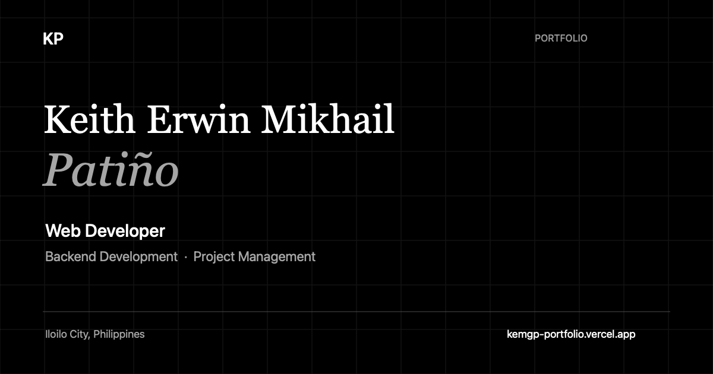

# Keith Erwin Mikhail Patiño — Portfolio

A personal portfolio showcasing my web development, backend development, interface design, and project-management work. Built as a responsive React site with project previews, a contact form, and support for reduced motion.

**[Visit the live portfolio](https://kemgp-portfolio.vercel.app/)**



*The portfolio’s social sharing image.*

## Features

- Responsive Home, About, Projects, and Contact sections.
- Sticky navigation with active-section highlighting and a mobile dropdown.
- Project previews, contribution summaries, technology badges, and demo/source links.
- Contact form with inline validation, sending feedback, success/error messages, and an email fallback.
- Keyboard focus indicators, a skip link, semantic headings, and screen-reader status announcements.
- Reduced-motion support for entrance effects, smooth scrolling, and the animated canvas background.
- Search metadata and Open Graph/social card tags with a 1200 × 630 sharing image.

## Technology

| Tool | Purpose |
| --- | --- |
| React | Components and interaction state |
| Vite | Local development and production builds |
| Tailwind CSS | Styling and responsive layouts |
| Motion | Entrance animations |
| Canvas API | Animated hero background |
| FormSubmit | Contact submissions through its AJAX endpoint |
| ESLint | Code checks |
| Node.js test runner | Contact validation and submission tests |
| Vercel | Production hosting |

The portfolio runs as a static frontend. Contact submissions use FormSubmit; there is no custom backend or database for this site.

## Run locally

Use Node.js 22.12+ and npm.

```bash
git clone https://github.com/kemgp/portfolio.git
cd portfolio
npm ci
npm run dev
```

Open the local URL printed by Vite. No environment variables are required for the current setup.

## Checks and production build

```bash
# Check application code
npm run lint

# Test contact validation and mocked submission responses
node --test tests/contact.test.mjs

# Generate the production site in dist/
npm run build

# Preview the production build locally
npm run preview
```

The automated contact tests do not send emails. Verify actual delivery separately through the deployed form.

## Project structure

```text
public/
  social-preview.png          Social sharing image
scripts/
  generate-social-preview.swift
src/
  assets/                     Project screenshots, icons, and portrait
  component/                  Page sections and visual components
  hooks/useReducedMotion.js   System motion preference subscription
  lib/contact.js              Contact validation and submission logic
  App.jsx                     Page layout and section landmarks
  main.jsx                    React entry point
  index.css                   Global styles and motion/focus rules
tests/
  contact.test.mjs             Contact tests using mocked requests
index.html                    Page title, metadata, and app entry
```

## Update content

- **Projects:** Edit the `projects` array in `src/component/Projects.jsx`. Add images to `src/assets/`, import them, and supply descriptive alt text and their actual dimensions. Optional `sourceUrl` and technology fields control the corresponding links and badges.
- **Profile:** Update `Hero.jsx`, `About.jsx`, and `footer.jsx` in `src/component/`.
- **Contact:** Update the recipient in `src/lib/contact.js` and the displayed contact details in `src/component/contact.jsx`. Submissions send the visitor’s name, email, and message to FormSubmit.
- **Search and sharing:** Edit `index.html`. Keep the canonical URL, Open Graph URL, and absolute sharing-image URLs aligned with the production domain.

The social image is committed to `public/`; normal builds do not require Swift. To regenerate it on macOS with Swift installed, edit and run:

```bash
swift scripts/generate-social-preview.swift
```

## Deployment

The production site is hosted at **https://kemgp-portfolio.vercel.app/**.

For a Vercel project using this repository, use:

- **Framework preset:** Vite
- **Build command:** `npm run build`
- **Output directory:** `dist`

After deployment, check section navigation, project links, the mobile menu, and contact delivery. Confirm `/social-preview.png` is publicly accessible and that shared links display the intended title and image.

## Credits

Created by **Keith Erwin Mikhail Patiño**, Iloilo City, Philippines.

The portfolio uses React, Vite, Tailwind CSS, and Motion for its interface, with FormSubmit handling contact requests. Dependency versions are recorded in `package.json` and `package-lock.json`.
